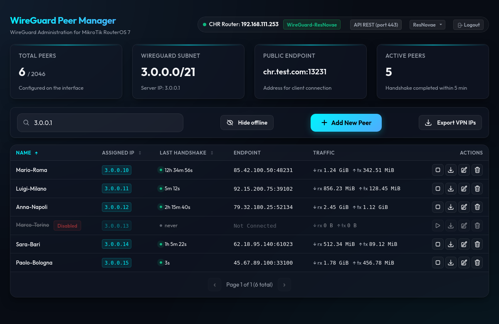
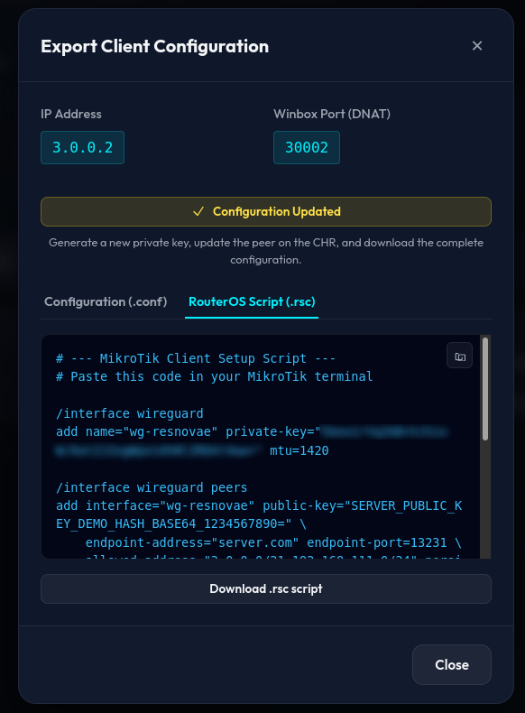

# MikroTik WireGuard Peer Manager

A lightweight PHP web dashboard for managing WireGuard peers on a MikroTik RouterOS 7 CHR. Features automatic IP allocation, X25519 key generation, client configuration export, and full i18n support (Italian/English).




## Features

- **Web Dashboard** — CRUD WireGuard peers via browser
- **Multi-Server** — Switch between MikroTik CHRs via header dropdown; separate configs per server
- **Auto IP Allocation** — Scans subnet, assigns next free IP
- **X25519 Key Gen** — `libsodium`-based key pairs with regeneration support
- **Config Export** — Download `.conf` or `.rsc` per peer
- **DNAT Port Display** — Winbox port calculated per peer (`dnat_base + octet3 × multiplier + octet4`)
- **Live Status** — Auto-refresh (default 30s), handshake/traffic monitoring, interface online/offline badge
- **Pagination** — Configurable page size (0 to disable)
- **i18n** — Italian/English
- **Startup Validation** — Misconfiguration shows a user-friendly error page

## Requirements

- **PHP 8.0+** with `ext-sodium`, `ext-json`, `allow_url_fopen=On`
- **MikroTik RouterOS 7.0+** with REST API (port 443) or Native API (port 8728/8729) enabled
- **Python 3.8+** + `librouteros` — only for `native` API mode

## Quick Start

```bash
git clone https://github.com/rollopack/mikrotik-wireguard.git
cd mikrotik-wireguard

# Create your first server configuration
cp configs/config.php.dist configs/myservername.php
# Edit configs/myservername.php with your MikroTik CHR credentials
# Repeat for additional servers — each gets its own file in configs/

# Open setup.php in your browser
# Set an admin password, then log in at login.php
# Use the server dropdown in the header to switch between CHRs
```

## Configuration

Server configurations live in the `configs/` directory. Each `.php` file is a separate server. The server selector dropdown in the dashboard lets you switch between them.

See `configs/config.php.dist` for a template with all available options:

| Key | Description |
|-----|-------------|
| `lang` | UI language (`it` or `en`) |
| `api_mode` | API mode: `rest` (default, port 443) or `native` (port 8728/8729) |
| `host` | Router IP or hostname |
| `username` | Router username |
| `password` | Router password |
| `ssl_verify` | Verify SSL certificate (`false` for self-signed) |
| `native_api` | Sub-array with `port`, `tls`, `python_script` for native mode |
| `interface` | WireGuard interface name on the router |
| `comment` | Display name in the server selector (falls back to `interface`, then filename) |
| `subnet` | WireGuard subnet in CIDR (e.g. `3.0.0.0/21`) |
| `server_ip` | Server IP inside the subnet |
| `endpoint` | Public endpoint for client connections (e.g. `vpn.example.com:13231`) |
| `client_allowed_ips` | Allowed IPs in generated client configs |
| `refresh_interval` | Dashboard auto-refresh interval in seconds (default: `30`) |
| `handshake_timeout` | Minutes before a peer is shown as offline (default: `5`) |
| `page_size` | Peers per page (default: `50`). Set to `0` to disable pagination |
| `dnat_base` | Base port for the DNAT formula (default: `30000`) |
| `dnat_multiplier` | Third octet multiplier in the DNAT formula (default: `1000`) |
| `export_mode` | Default export format after creation or key regeneration (`conf` or `rsc`). Default: `rsc` |

The active server is resolved in this order:
1. `?server=key` URL parameter
2. Session-stored preference (persisted after first selection)
3. First available config file (alphabetically)

## API Modes

Set `api_mode` in the server's config file. Credentials fall back to the main config.

| Mode | Description | Requirements |
|------|-------------|--------------|
| `rest` (default) | RouterOS REST API via HTTPS (port 443). | `allow_url_fopen=On` |
| `native` | Native API (port 8728/8729) via Python bridge. Alternative when REST is unavailable. | Python 3.8+, `librouteros` |

See `configs/config.php.dist` for the `native_api` sub-array structure.

## DNAT Port Forwarding

This feature calculates a unique DNAT port for each peer so you can reach the client's router via Winbox through the CHR, without exposing the client to the Internet. You need to **manually** create a `dst-nat` rule on the CHR:

```
/ip firewall nat add chain=dstnat action=dst-nat \
    protocol=tcp dst-port=DNAT_PORT \
    to-addresses=CLIENT_WG_IP to-ports=8291
```

The dashboard only *displays* the computed port — it does not manage firewall rules. Clicking a peer's IP badge copies the DNAT port to your clipboard.

The formula is:

```
DNAT_PORT = dnat_base + third_octet * dnat_multiplier + fourth_octet
```

Configure `dnat_base` and `dnat_multiplier` in your server's config file (under `configs/`) to fit your subnet (see [Configuration](#configuration)).

**Example with defaults (`dnat_base=30000`, `dnat_multiplier=1000`):**  
Peer IP `3.0.0.24` → port `30000 + 0 * 1000 + 24 = **30024**`  
CHR rule: `dst-port=30024` → `to-addresses=3.0.0.24 to-ports=8291`  
Winbox connection: `CHR_IP:30024`

## Security

- **`config.php` and `configs/*.php` are gitignored** — router credentials stay local
- **Private keys are never stored** on the server after the modal is closed
- **IP restriction via `.htaccess`** — see `.htaccess.example` for setup instructions
- **Dashboard authentication** — PHP session login, mandatory. To set it up:
  - Visit `setup.php` in your browser, enter a password once
  - The password hash is stored in `.admin-hash` (gitignored)
  - Alternative: `php -r "echo password_hash('your_pass', PASSWORD_BCRYPT);" > .admin-hash`
  - Until a password is set, every page redirects to `setup.php`
  - After setup, all pages (`index.php`, `api.php`) require login; unauthenticated API calls return `401 Unauthorized`
  - Session timeout: 30 minutes of inactivity
- **display_errors disabled** in production — no PHP error leakage
- **Brute-force protection** — login locked for 5 minutes after 5 failed attempts
- **Intended for LAN use only** — do not expose to the Internet without additional security layers

## Testing

```bash
php tests/run_tests.php
```

Uses a mock REST client — no real router needed. 296 assertions covering key generation, IP allocation, config formatting, API interaction, peer CRUD (incl. collision detection), config validation, URL construction, authentication, brute-force lockout, session management, interface status, multi-server config resolution, and export mode validation across 133 tests.

> **Disclaimer:** This software is provided "as is" without warranty of any kind. The author assumes no responsibility for any direct or indirect damages arising from its use. Use at your own risk.

## License

GNU General Public License v3.0

Copyright (C) 2026 Rolland Gabriel (https://github.com/rollopack)
