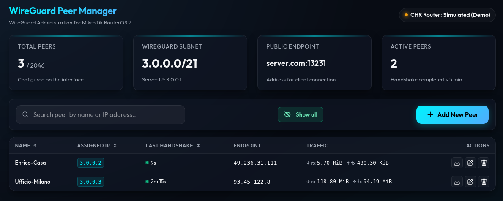

# MikroTik WireGuard Peer Manager

A lightweight PHP web dashboard for managing WireGuard peers on a MikroTik RouterOS 7 CHR. Features automatic IP allocation, X25519 key generation, client configuration export, and full i18n support (Italian/English).




## Features

- **Web Dashboard** — List, create, edit, delete WireGuard peers via browser
- **Automatic IP Allocation** — Scans subnet and assigns the next free IP
- **X25519 Key Generation** — Uses `libsodium` for cryptographic key pairs
- **Client Config Export** — Download `.conf` (WireGuard) or `.rsc` (RouterOS script)
- **Key Regeneration** — Rotate keys without deleting/recreating peers
- **Winbox DNAT Port** — Calculate and display the DNAT port for Winbox access to client routers through the CHR (`CHR_IP:DNAT_PORT`). Formula: `dnat_base + third_octet * dnat_multiplier + fourth_octet`, configurable via `config.php`.
- **Internationalization** — Italian and English UI, switchable via `config.php`
- **Live Status** — Auto-refresh every 10s, real-time handshake/traffic monitoring
- **Config Validation** — Startup validation with user-friendly error page for misconfiguration
- **Consistent Error Handling** — All API layers throw exceptions with context

## Requirements

### PHP

| Component | Required | Notes |
|-----------|----------|-------|
| PHP | 8.0+ | |
| `ext-sodium` | Yes | For X25519 key generation (`sodium_crypto_scalarmult_base`) |
| `ext-json` | Yes | For JSON encoding/decoding |
| `allow_url_fopen` | `On` | Required by `file_get_contents()` for REST API calls |

### MikroTik RouterOS 7 CHR

| Component | Required | Notes |
|-----------|----------|-------|
| RouterOS | 7.0+ | REST API requires RouterOS 7 |
| REST API | Enabled | `/ip/service/set www-ssl disabled=no port=443` |
| Firewall | Open port 443 | From the dashboard server to the CHR |
| WireGuard | Interface created | e.g. `WireGuard-ResNovae` |
| SSL Certificate | Self-signed OK | Set `ssl_verify: false` in config |

### Web Server (Dashboard Host)

| Component | Notes |
|-----------|-------|
| Apache / Nginx | Any with PHP-FPM |
| PHP | 8.0+ with extensions above |
| Network access | To CHR REST API on port 443 |
| .htaccess support | For IP restriction (optional) |

## Quick Start

```bash
git clone https://github.com/rollopack/mikrotik-wireguard.git
cd mikrotik-wireguard

cp config.example.php config.php
# Edit config.php with your MikroTik CHR credentials

# Open index.php in your browser
# Connection error banner appears if CHR is unreachable
```

## Configuration

See `config.example.php` for all available options:

| Key | Description |
|-----|-------------|
| `lang` | UI language (`it` or `en`) |
| `host` | Router IP or hostname (e.g. `https://192.168.88.1`) |
| `username` | Router username |
| `password` | Router password |
| `ssl_verify` | Verify SSL certificate (`false` for self-signed) |
| `interface` | WireGuard interface name on the router |
| `subnet` | WireGuard subnet in CIDR (e.g. `3.0.0.0/21`) |
| `server_ip` | Server IP inside the subnet |
| `endpoint` | Public endpoint for client connections (e.g. `vpn.example.com:13231`) |
| `client_allowed_ips` | Allowed IPs in generated client configs |
| `dnat_base` | Base port for the DNAT formula (default: `30000`) |
| `dnat_multiplier` | Third octet multiplier in the DNAT formula (default: `1000`) |

## DNAT Port Forwarding

This feature calculates a unique DNAT port for each peer so you can reach the client's router via Winbox through the CHR, without exposing the client to the Internet. You need to **manually** create a `dst-nat` rule on the CHR:

```
/ip firewall nat add chain=dstnat action=dst-nat \
    protocol=tcp dst-port=DNAT_PORT \
    to-addresses=CLIENT_WG_IP to-ports=8291
```

The dashboard only *displays* the computed port — it does not manage firewall rules. Clicking a peer's IP badge copies the DNAT port to your clipboard.

The formula is:

```
DNAT_PORT = dnat_base + third_octet * dnat_multiplier + fourth_octet
```

Configure `dnat_base` and `dnat_multiplier` in `config.php` to fit your subnet (see [Configuration](#configuration)).

**Example with defaults (`dnat_base=30000`, `dnat_multiplier=1000`):**  
Peer IP `3.0.0.24` → port `30000 + 0 * 1000 + 24 = **30024**`  
CHR rule: `dst-port=30024` → `to-addresses=3.0.0.24 to-ports=8291`  
Winbox connection: `CHR_IP:30024`

## Security

- **`config.php` is gitignored** — router credentials stay local
- **Private keys are never stored** on the server after the modal is closed
- **IP restriction** via `.htaccess` (default: `192.168.111.x`)
- **display_errors disabled** in production — no PHP error leakage
- **Intended for LAN use only** — do not expose to the Internet without additional security layers

## Project Structure

```
├── .gitignore                # Ignores config.php, temp/, etc.
├── .htaccess                 # IP restriction (192.168.111.x)
├── config.php               # Router credentials (gitignored)
├── config.example.php       # Configuration template
├── index.php                # Dashboard UI
├── screenshots/
│   ├── Dashboard.png
│   └── Export.png
├── assets/
│   ├── css/
│   │   └── app.css
│   └── js/
│       └── app.js
├── src/
│   ├── api.php                      # AJAX API endpoints
│   ├── WireGuardManager.php         # Business logic
│   ├── MikrotikRestClient.php       # REST API client (file_get_contents)
│   ├── ConfigValidator.php          # Configuration validation
│   ├── i18n.php                     # Translation helpers
│   └── lang/
│       ├── it.php                   # Italian strings
│       └── en.php                   # English strings
└── tests/
    ├── run_tests.php
    └── WireGuardManagerTest.php
```

## Testing

```bash
php tests/run_tests.php
```

Uses a mock REST client — no real router needed. 42 assertions covering key generation, IP allocation, config formatting, API interaction, peer CRUD operations (add, update, delete, regenerate key).

> **Disclaimer:** This software is provided "as is" without warranty of any kind. The author assumes no responsibility for any direct or indirect damages arising from its use. Use at your own risk.

> **Warning:** This tool is designed for use on **trusted local networks**. If exposed to the Internet, additional security measures such as HTTP authentication, firewall, SSL reverse proxy, rate limiting, and access monitoring must be implemented. This script does not provide built-in protection against external attacks.

## License

MIT
